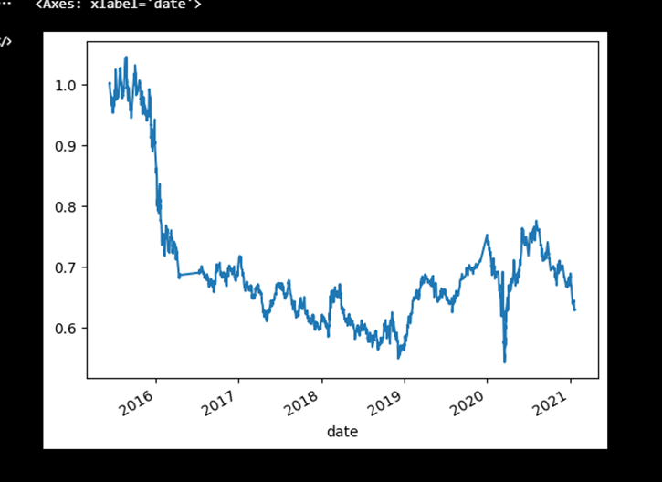
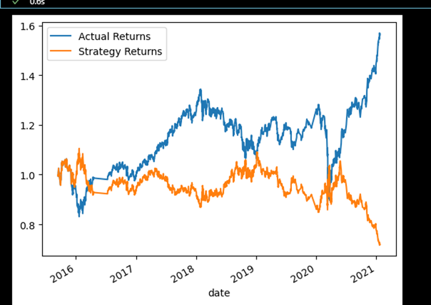
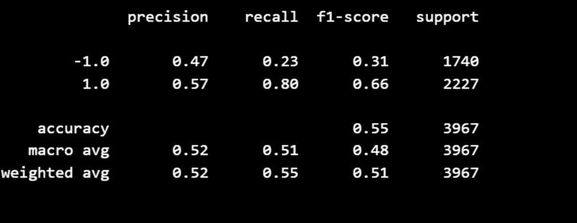
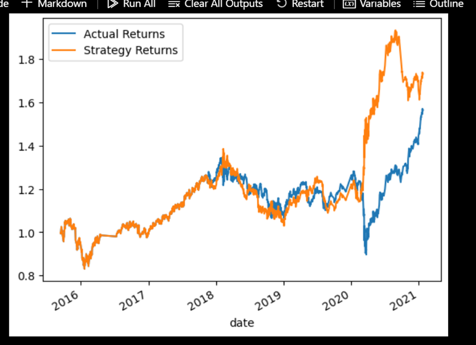

Algorithmic_Trading_CH14
Algorithmic_Trading
# Technology 
 These are the technologies the user can use to run the solution -- Jupyter notebook  -- Python -- Github -- To download the solution file. It's saved in githun as public
Test Data 
emerging_markets_ohlcv.csv
 # Contributors 
 The solution is developed by Eyasu Alemu LinkdIn account -- https://www.linkedin.com/in/eyasu-a-684854112 Email -- Bekaqa01@gmail.com Phone Number -- 202 344 0733

Using the starter code file and the provided csv complete the following steps.
	Establish a Baseline Performance
	Tune the Baseline Trading Algorithm
	Evaluate a New Machine Learning Classifier
	Create an Evaluation Report

1. Establish a Baseline Performance

	Import the OHLCV dataset into a Pandas DataFrame.
	Generate trading signals using short- and long-window SMA values.
 
	Split the data into training and testing datasets.
	Use the SVC classifier model from SKLearn's support vector machine (SVM) learning method to fit the training data and make predictions based on the testing data. Review the predictions.
	Review the classification report associated with the SVC model predictions.
	Create a predictions DataFrame that contains columns for “Predicted” values, “Actual Returns”, and “Strategy Returns”.
	Run and save a PNG image of this plot. This will serve as a baseline against which to compare the effects of tuning the trading algorithm.

 

2.	Tune the Baseline Trading Algorithm

3.	Evaluate a New Machine Learning Classifier

 
 

4.	Create an Evaluation Report
